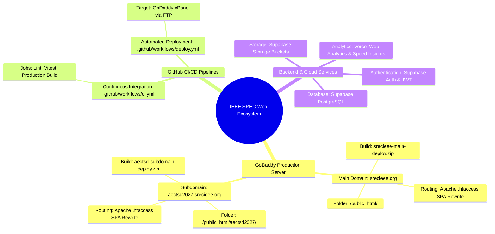
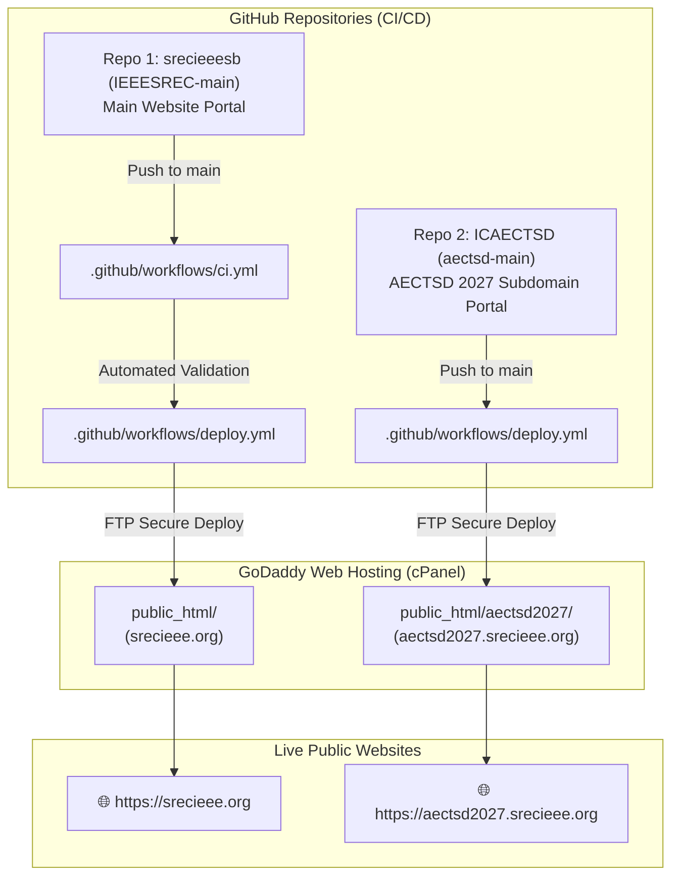

<div align="center">

# ⚡ IEEE SREC Web Platform & Ecosystem
### The Official Web Architecture, Portal, and Subdomain Subsystems for IEEE Student Branch SREC (STB32131 / STB64071)

[](https://github.com/Surya-Narayanan-K-S/SRECIEEESB/actions)
[](https://react.dev/)
[](https://developer.mozilla.org/en-US/docs/Web/JavaScript)
[](https://vitejs.dev/)
[](https://tailwindcss.com/)
[](https://supabase.com/)
[](https://vitest.dev/)
[](LICENSE)

[**Live Production Portal**](https://srecieee.org) • [**AECTSD Conference Portal**](https://aectsd2027.srecieee.org) • [**Documentation**](#-system-architecture) • [**Contributing**](CONTRIBUTING.md)

</div>

---

## 📖 Overview

The **IEEE SREC Web Platform** is an enterprise Single Page Application (SPA) and content management ecosystem built for the **IEEE Student Branch at Sri Ramakrishna Engineering College (SREC), Coimbatore** (IEEE Madras Section, Region 10).

The ecosystem powers the public student branch portal, 8 specialized technical society chapter micro-portals, real-time event reporting, leadership roster indexing, administrative content management, and dynamic PDF membership credential generation with live Forex currency conversions.

---

## 🧠 System Architecture



---

## 🗺️ Dual Repository & Host Pipeline



---

## ✨ Key Features & Capabilities

- **🏛️ Dynamic Society Chapters**: Dedicated portals for Computer Society (CS), Power Electronics (PELS), Women in Engineering (WIE), Computational Intelligence (CIS), Communications (ComSoc), Medicine & Biology (EMBS), Instrumentation & Measurement (IMS), and SREC Branch Hub.
- **💱 Live Forex Rate Engine**: Real-time USD to INR exchange rate integration using Fawaz Ahmed Currency API with automated 5-minute polling, dynamic INR calculations, and itemized receipt breakdowns.
- **🪪 Identity Card & Certificate Engine**: Dynamic client-side and server-backed PDF rendering engine generating official IEEE credential cards with QR verification.
- **🔒 Inspection & Security Guard**: Intelligent DevTools detection and asset cloaking preventing unauthorized source copying and asset extraction.
- **🔐 Role-Based Administrative CMS**: Secure admin dashboard for managing event reports, executive committee rosters, gallery assets, and student directory records.
- **📊 Real-time Supabase Database**: PostgreSQL schema with Row-Level Security (RLS) policies and asset buckets.
- **📱 Hybrid Mobile Ready**: Integrated with **Capacitor 8** for Android APK compilation.
- **⚡ Performance First**: Vite 7 bundle chunking, modern image compression, and sub-second page transitions.

---

## 📂 Project Structure

```text
IEEESREC-main/
├── .github/                      # CI/CD workflows and PR templates
├── public/                       # Static public assets, icons, manifest
├── resources/                    # Database migrations, archives, scripts
│   ├── database/                 # SQL schemas and versioned migrations
│   └── tests/                    # Test configuration files
├── src/
│   ├── assets/                   # Vector logos, society graphics, imagery
│   ├── components/               # Modular UI component hierarchy
│   │   ├── about/                # About, publications, research components
│   │   ├── gallery/              # Lightbox gallery, counter, media viewer
│   │   ├── home/                 # Hero, impact, highlights, testimonials
│   │   ├── layout/               # Navbar, footer, navigation links
│   │   ├── modals/               # Modals, chatbots, download prompts
│   │   ├── security/             # DevTools inspection lock & asset cloaking
│   │   ├── societies/            # Society roster cards & chapter components
│   │   └── ui/                   # Radix atomic UI design system
│   ├── hooks/                    # Custom React hooks (useCurrencyExchange, useContent)
│   ├── lib/                      # Supabase client and utilities
│   ├── pages/                    # 25+ Application route views
│   │   ├── admin/                # Secure CMS & leadership admin dashboards
│   │   ├── home/                 # Main landing experience
│   │   ├── info/                 # About, team, awards, funding, contact
│   │   ├── office-bearers/       # Branch and past leadership rosters
│   │   ├── reports/              # Interactive event reports & media
│   │   ├── societies/            # 8 society chapter individual pages
│   │   └── student/              # Student portal, auth & registration
│   ├── styles/                   # Global CSS & Tailwind design tokens
│   ├── test/                     # Vitest unit and integration test suite
│   ├── utils/                    # PDF generator, currency API, data helpers
│   ├── App.jsx                   # Master routing & provider tree
│   └── main.jsx                  # Application entry point
├── eslint.config.js              # ESLint configuration
├── jsconfig.json                 # Path aliases configuration
├── tailwind.config.js            # Tailwind design system configuration
├── vite.config.js                # Vite build and bundle configuration
└── vitest.config.js              # Vitest test runner configuration
```

---

## 🛠️ Local Development & Quickstart

### Prerequisites
- Node.js v20.x or higher
- npm v10.x or higher

### 1. Clone & Install
```bash
git clone https://github.com/Surya-Narayanan-K-S/SRECIEEESB.git
cd SRECIEEESB
npm install
```

### 2. Environment Configuration
Create a `.env` file from `.env.example`:
```bash
cp .env.example .env
```
```env
VITE_SUPABASE_URL=https://your-project.supabase.co
VITE_SUPABASE_ANON_KEY=your-supabase-anon-key
```

### 3. Start Development Server
```bash
npm run dev
```

---

## 🧪 Testing & Verification

```bash
# Code Quality Check
npm run lint

# Automated Linter Fixes
npm run lint:fix

# Run Vitest Suite
npm run test

# Production Build
npm run build
```

---

## 🗄️ Database & Migrations

All PostgreSQL schemas and versioned SQL scripts reside in [`resources/database/`](resources/database/):

| Schema File | Purpose |
| :--- | :--- |
| `resources/database/schema.sql` | Core schema for branch database tables |
| `resources/database/migrations/` | Versioned incremental database migrations |
| `resources/database/societies_table.sql` | Chapter metadata and leadership tables |
| `resources/database/create_event_reports_table.sql` | Event reports and media attachments |
| `resources/database/membership_registration_schema.sql` | Student membership directory and cards |

---

## 🚀 Deployment

### Automated GitHub Actions Deploy

1. Set the following repository secrets (**Settings > Secrets and variables > Actions**):
   - `FTP_SERVER`
   - `FTP_USERNAME`
   - `FTP_PASSWORD`
   - `VITE_SUPABASE_URL`
   - `VITE_SUPABASE_ANON_KEY`

2. Every commit pushed to the `main` branch will automatically run quality tests and deploy via FTP to GoDaddy cPanel.

---

## 📄 License & Copyright

**All Rights Reserved.**

This codebase and associated digital assets are confidential and proprietary intellectual property of **IEEE Student Branch SREC (STB32131 / STB64071)**. Unauthorized copying, cloning, modification, redistribution, or reverse engineering of this software or any portion thereof is strictly prohibited. See [`LICENSE`](LICENSE) for complete terms.

© 2024–2026 **IEEE Student Branch SREC**. All rights reserved.
