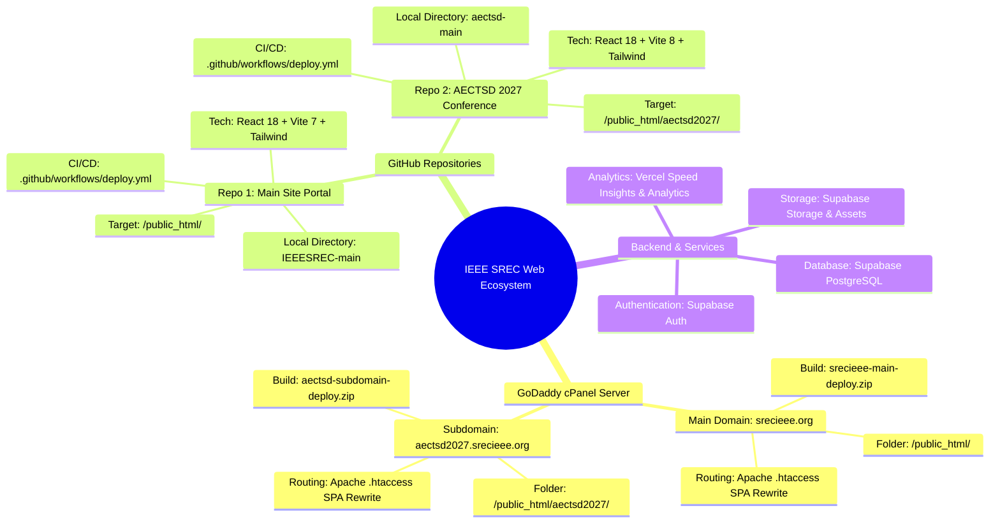
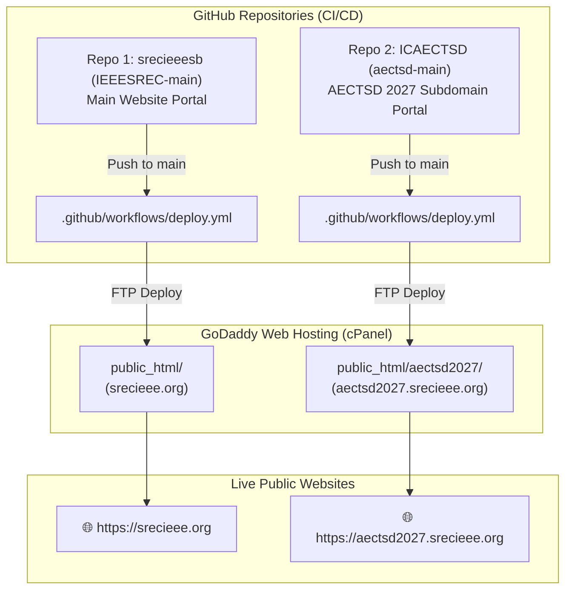
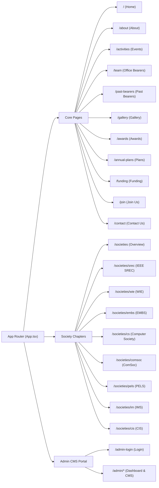

# ⚡ IEEE SREC Web Platform & Subdomain Ecosystem

> Official web architecture and deployment documentation for the IEEE Student Branch at Sri Ramakrishna Engineering College (SREC), Coimbatore.

---

## 🧠 System Architecture Mind Map



---

## 🗺️ Dual Repository & Host Mapping



---

## 📊 Dual Repository Summary Matrix

| Feature / Detail | Repository 1: Main Website | Repository 2: Conference Subdomain |
| :--- | :--- | :--- |
| **Public URL** | [`https://srecieee.org`](https://srecieee.org) | [`https://aectsd2027.srecieee.org`](https://aectsd2027.srecieee.org) |
| **Local Folder** | `IEEESREC-main` | `aectsd-main` |
| **GoDaddy Folder** | `public_html/` | `public_html/aectsd2027/` |
| **GitHub Action** | `.github/workflows/deploy.yml` | `.github/workflows/deploy.yml` |
| **ZIP Package** | `srecieee-main-deploy.zip` | `aectsd-subdomain-deploy.zip` |
| **Routing Setup** | `.htaccess` (SPA rewrite to `/index.html`) | `.htaccess` (SPA rewrite to `/index.html`) |

---

## 🌐 Main Website Page Index (`srecieee.org`)

The main repository contains 24+ pages compiled into a Single Page Application (SPA):



---

## 🛠️ Local Development & Build Workflow

### Repository 1: Main Site (`IEEESREC-main`)
```bash
cd IEEESREC-main
npm install
npm run dev     # Starts local server on http://localhost:5173
npm run build   # Compiles production build into dist/
```

### Repository 2: Subdomain Site (`aectsd-main`)
```bash
cd aectsd-main
bun install     # or npm install
bun dev         # Starts local server on http://localhost:5173
bun run build   # Compiles production build into dist/
```

---

## ☁️ GoDaddy Deployment Instructions

### 📦 Option A: Quick Upload via cPanel File Manager

1. **Main Site (`srecieee.org`)**:
   - Build `IEEESREC-main` $\rightarrow$ Zip contents of `dist/` into `srecieee-main-deploy.zip`.
   - Open cPanel File Manager $\rightarrow$ Navigate to `public_html/`.
   - Upload `srecieee-main-deploy.zip` and click **Extract**.

2. **Subdomain Site (`aectsd2027.srecieee.org`)**:
   - Create subdomain `aectsd2027` in GoDaddy cPanel pointing to `public_html/aectsd2027`.
   - Build `aectsd-main` $\rightarrow$ Zip contents of `dist/` into `aectsd-subdomain-deploy.zip`.
   - Open cPanel File Manager $\rightarrow$ Navigate to `public_html/aectsd2027/`.
   - Upload `aectsd-subdomain-deploy.zip` and click **Extract**.

---

### 🔄 Option B: Automated Push-to-Deploy via GitHub Actions

Add the following **Secrets** in each GitHub repository (**Settings > Secrets and variables > Actions**):

* `FTP_SERVER`: GoDaddy FTP Server Host (e.g. `ftp.srecieee.org` or IP)
* `FTP_USERNAME`: GoDaddy cPanel FTP Username
* `FTP_PASSWORD`: GoDaddy cPanel FTP Password
* `VITE_SUPABASE_URL`: Supabase Project URL
* `VITE_SUPABASE_ANON_KEY`: Supabase Public Anon Key

Once added, pushing any commit to `main` branch will automatically build and deploy the changes via FTP!

---

## 📄 License & Copyright

© IEEE Student Branch SREC (STB64071). All rights reserved.
